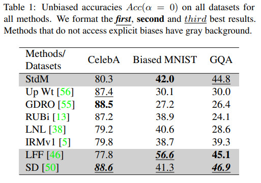
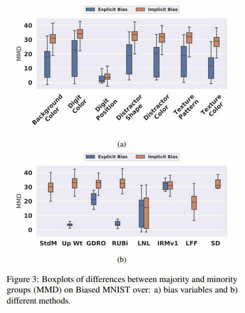
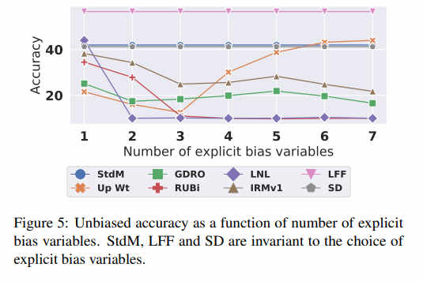
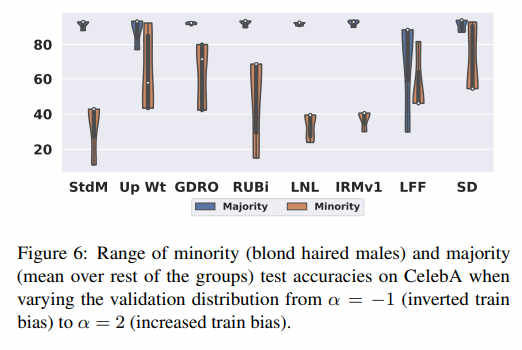

##  An Investigation of Critical Issues in Bias Mitigation Techniques

Our paper (https://arxiv.org/abs/2104.00170) examines if the state-of-the-art bias mitigation methods are able to perform well on more realistic settings: with multiple sources of biases, hidden biases and without access to test distributions. This repository has implementations/re-implementations for seven popular techniques.

  
### Setup

#### Install Dependencies

`conda create -n bias_mitigator python=3.7`

`source activate bias_mitigator`

`conda install pytorch==1.4.0 torchvision==0.5.0 cudatoolkit=10.1 -c pytorch`

`conda install tqdm opencv pandas`

#### Configure Path

- Edit the `ROOT` variable in `common.sh`. This directory will contain the datasets and the experimental results.

#### Datasets

- For each dataset, we test on train, val and test splits. Each dataset file contains a function to create a dataloader for all of these splits.

##### Biased MNIST
Coming Soon -- We may make some improvements to the dataset. We plan on releasing it by June, 2021.

##### CelebA
- Download the dataset [from here](https://drive.google.com/drive/folders/0B7EVK8r0v71pWEZsZE9oNnFzTm8) and extract the data to `${ROOT}`
- We adapted the data loader from `https://github.com/kohpangwei/group_DRO`

##### GQA-OOD
- Download GQA (object features, spatial features and questions) [from here](https://cs.stanford.edu/people/dorarad/gqa/download.html)
- Build the GQA-OOD by following [these instructions](https://github.com/gqa-ood/GQA-OOD/tree/master/code)

- Download embeddings
`python -m spacy download en_vectors_web_lg`

-  Preprocess visual/spatial features
`./scripts/gqa-ood/preprocess_gqa.sh`

#### Run the methods

We have provided a separate bash file for running each method on each dataset in the `scripts` directory. Here is a sample script: 

```bash
source activate bias_mitigator

TRAINER_NAME='BaseTrainer'
lr=1e-3
wd=0
python main.py \
--expt_type celebA_experiments \
--trainer_name ${TRAINER_NAME} \
--lr ${lr} \
--weight_decay ${wd} \
--expt_name ${TRAINER_NAME} \
--root_dir ${ROOT}
```

### Contribute!

- If you want to add more methods, simply follow one of the implementations inside `trainers` directory.


### Highlights from the paper:

1. Overall, methods fail when datasets contain multiple sources of bias, even if they excel on smaller settings with one or two sources of bias (e.g., CelebA). 


2. Methods can exploit both implicit (hidden) and explicit biases.
 
 
3. Methods cannot handle multiple sources of bias even when they are explicitly labeled.


4. Most methods show high sensitivity to the tuning distribution especially for minority groups



### Citation
Coming soon... 
